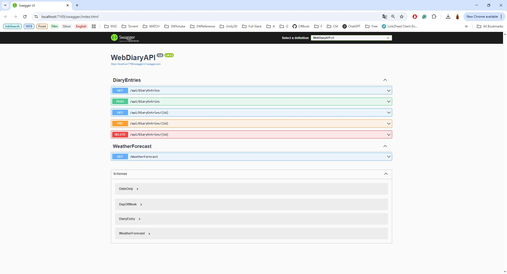

<h1>📘 WebDiaryAPI</h1>
  
<strong>WebDiaryAPI</strong> is a RESTful API built with ASP.NET Core, designed to manage personal diary entries. It allows users to create, read, update, and delete diary entries securely.

  <h2>⚙️ Technologies Used</h2>
  <ul>
    <li>C#</li>
    <li>ASP.NET Core</li>
    <li>Entity Framework Core</li>
    <li>SQL Server</li>
    <li>JWT Authentication</li>
    <li>Swagger (OpenAPI)</li>
  </ul>

  <h2>📦 Installation</h2>
  <ol>
    <li>Clone the repository:
      <pre><code>git clone https://github.com/ilmarvvv/WebDiaryAPI.git
cd WebDiaryAPI</code></pre>
    </li>
    <li>Open the solution <code>WebDiaryAPI.sln</code> in Visual Studio.</li>
    <li>Restore NuGet packages.</li>
    <li>Configure your SQL Server connection string in <code>appsettings.json</code>.</li>
    <li>Apply migrations to create the database:
      <pre><code>Update-Database</code></pre>
    </li>
    <li>Run the application (F5 or click "Start").</li>
  </ol>

  <h2>🚀 Features</h2>
  <ul>
    <li>User registration and authentication</li>
    <li>Create, read, update, and delete diary entries</li>
    <li>Secure access to user-specific entries</li>
    <li>API documentation with Swagger</li>
  </ul>

  <h2>🔐 Authentication</h2>
  
This API uses JWT (JSON Web Tokens) for authentication. After registering and logging in, include the token in the <code>Authorization</code> header for protected endpoints.

  <h2>📸 API Documentation</h2>
  
Swagger UI is available at:

  <pre><code>https://localhost:5001/swagger</code></pre>
  
Use this interface to explore and test the API endpoints.

  

  <h2>👤 ILLIA SHEVIAKOV</h2>
